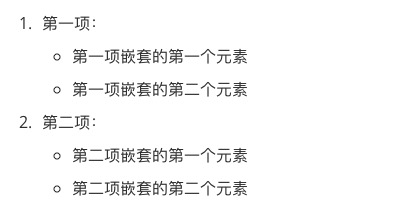

# 前言

## 为什么要写这篇文章

对于一个学习计算机的学生而言，了解[Git](https://git-scm.com/)和[GitHub](https://github.com/)是一个很基础的东西，前者会更加方便你与其它人一同协作办公，后者更方便你去寻找前人留下的足迹（防止盲目造轮子），因此，制作了本篇教程，用于教大家如何去更好的了解以及使用其进行后续工作。

本篇教程会分为三个部分进行讲解，[Markdown篇](#1)、[Git篇](#2)、GitHub篇，到最后会有一个属于自己的小任务，如制作完毕可以将自己的仓库地址留存到本仓库中的[`honour.md`](https://github.com/GUET-EETB/GitHub-exercise/blob/main/honour.md)中(提交个人完成情况时可以顺便修改此文件信息)

本篇教程仅自己的一些见解，如有问题，请提出issue或使用PR进行修正  
如果学习完成，可以[点击此处](https://github.com/GUET-EETB/GitHub-exercise/blob/main/YourAssessment.md)来跳转到实践部分  

## 我需要做什么

在本篇教程中，你能学会并了解如下几点：

- 了解[Markdown](https://baike.baidu.com/item/markdown/3245829)，知道它的基础用法
- 了解[Git](https://git-scm.com/)，明白它的基础语法，以及能够使用其进行简单操作
- 了解[GitHub](https://github.com/)，明白其基本用途，学会如何去运用它


## 推荐

由于有些资料以及相关资源的服务器存放位置均不在国内，并且校园网对于GitHub的访问一直都不是很友好，因此推荐准备一个科学上网工具，在此处不做延申


# <a id='1'>Markdown篇</a>

## 什么是Markdown？

> Markdown 是一种[轻量级标记语言](https://baike.baidu.com/item/轻量级标记语言/52671915?fromModule=lemma_inlink)，创始人为约翰·格鲁伯（John Gruber）。 它允许人们使用易读易写的[纯文本格式](https://baike.baidu.com/item/纯文本格式/9862288?fromModule=lemma_inlink)编写文档，然后转换成有效的 [XHTML](https://baike.baidu.com/item/XHTML/316621?fromModule=lemma_inlink)（或者HTML）文档。这种语言吸收了很多在电子邮件中已有的纯文本标记的特性。
>
> 由于 Markdown 的轻量化、易读易写特性，并且对于图片，图表、数学式都有支持，许多网站都广泛使用 Markdown 来撰写帮助文档或是用于论坛上发表消息。 如 [GitHub](https://baike.baidu.com/item/GitHub/10145341?fromModule=lemma_inlink)、[Reddit](https://baike.baidu.com/item/Reddit/1272010?fromModule=lemma_inlink)、[Diaspora](https://baike.baidu.com/item/Diaspora/10726893?fromModule=lemma_inlink)、[Stack Exchange](https://baike.baidu.com/item/Stack Exchange/13777796?fromModule=lemma_inlink)、[OpenStreetMap](https://baike.baidu.com/item/OpenStreetMap/3171606?fromModule=lemma_inlink) 、[SourceForge](https://baike.baidu.com/item/SourceForge/6562141?fromModule=lemma_inlink)、[简书](https://baike.baidu.com/item/简书/5782216?fromModule=lemma_inlink)等，甚至还能被使用来撰写[电子书](https://baike.baidu.com/item/电子书/346054?fromModule=lemma_inlink)。
>
> ——百度百科


其优势在于可以很快的使用易读易写的纯文本格式生成属于自己的一篇风格化文档，能够极大的节约自身时间以及有着比word更强的适配性（起码不用电脑里装个word或wps才能打开2333）


## 我如何去上手？

对于Markdown编辑器，在各种平台上有着各种各样的介绍，在此处简做小推荐：

1. [Typora](https://typora.io/)

   优点：

   - 好用
   - 易上手
   - 支持中文
   - 各大中文平台推荐较多

   缺点：

   - 从 `1.0`版本之后就需要进行花钱购买
   - 由于从开源转为闭源，插件少

2. [MarkText](https://github.com/marktext/marktext)

   优点：

   - 也很好用
   - 一直开源
   - 插件种类丰富，功能繁多
   - 帮助你学习四级 (bushi

   缺点：

   - 纯英文界面，需要有一定的英文功底
   - 各大平台介绍相对较少，相关中文文档介绍少

## 基本命令

此处文章从[菜鸟教程-Markdown](https://www.runoob.com/markdown/md-tutorial.html)处进行CV过来的，这里仅作介绍，详情可点击[链接](https://www.runoob.com/markdown/md-tutorial.html)前往原文

### 标题

在Markdown中，有两种方式可以使用标题：

#### 1. 使用 `=` 和 `-` 标记一级和二级标题（不常用）

通过使用`=` 和 `-`来对标题进行划分，例如：

```markdown
我展示的是一级标题
=================

我展示的是二级标题
-----------------
```


#### 2. 使用 `#`去划分标题（常用）

使用 `#` 号可表示 1-6 级标题，一级标题对应一个 `#` 号，二级标题对应两个 `#` 号，以此类推。

在某些编辑器里，可以使用<kbd>Ctrl</kbd>+<kbd>数字</kbd>来指定对应的标题序号

展示效果如下：


### 换行

Markdown 段落没有特殊的格式，直接编写文字就好，**段落的换行是使用两个以上空格加上回车**。

当然也可以在段落后面使用一个空行来表示重新开始一个段落。


### 字体

Markdown 可以使用以下几种字体：

```markdown
*斜体文本*
_斜体文本_
**粗体文本**
__粗体文本__
***粗斜体文本***
___粗斜体文本___
```

效果图如下：


### 分割线

你可以在一行中用三个以上的星号、减号、底线来建立一个分隔线，行内不能有其他东西。你也可以在星号或是减号中间插入空格。下面每种写法都可以建立分隔线：

```markdown
***

* * *

*****

- - -

----------
```

效果如下图所示：


### 删除线

如果段落上的文字要添加删除线，只需要在文字的两端加上两个波浪线 **~~** 即可，实例如下：

```markdown
RUNOOB.COM
GOOGLE.COM
~~BAIDU.COM~~
```


### 列表

#### 无序列表

无序列表使用星号(**`*`**)、加号(**`+`**)或是减号(**`-`**)作为列表标记，这些标记后面要添加一个空格，然后再填写内容：

```markdown
* 第一项
* 第二项
* 第三项

+ 第一项
+ 第二项
+ 第三项


- 第一项
- 第二项
- 第三项
```

如下图所示：


#### 有序列表

有序列表使用数字并加上 **`.`** 号来表示，如：

```markdown
1. 第一项
2. 第二项
3. 第三项
```

显示效果如图所示：


#### 列表嵌套

列表嵌套只需在子列表中的选项前面添加两个或四个空格即可：

```markdown
1. 第一项：
    - 第一项嵌套的第一个元素
    - 第一项嵌套的第二个元素
2. 第二项：
    - 第二项嵌套的第一个元素
    - 第二项嵌套的第二个元素
```



### 引用区块

Markdown 区块引用是在段落开头使用 **`>`** 符号 ，然后后面紧跟一个**空格**符号：

```markdown
> 区块引用
> 菜鸟教程
> 学的不仅是技术更是梦想
```

如图显示：


另外区块是可以嵌套的，一个 **`>`** 符号是最外层，两个 **`>`** 符号是第一层嵌套，以此类推：

```markdown
> 最外层
> > 第一层嵌套
> > > 第二层嵌套
```


### 代码

如果是段落上的一个函数或片段的代码可以用反引号把它包起来（`），例如：

```markdown
`printf()` 函数
```

结果如下：


#### 代码区块

可以用 **```** 包裹一段代码，并指定一种语言（也可以不指定）：

~~~javascript
```
$(document).ready(function () {
    alert('RUNOOB');
});
```
~~~

显示如下：

如果你在写一篇博文，推荐使用代码标注来让自己的代码部分与正文内容进行区别，否则会显得怪怪的，对于代码区块，推荐选择好一种语言，因为编辑器会自动解析相关的语法规范，会有颜色提示。对于一些编辑器来讲，当你输入完（```）之后，回车便会先让你选择代码语言


### 链接

链接使用方法如下：

```markdown
[链接名称](链接地址)

或者

<链接地址>
这是一个链接 [菜鸟教程](https://www.runoob.com)
```


#### 高级链接

我们可以通过变量来设置一个链接，变量赋值在文档末尾进行：

```markdown
这个链接用 1 作为网址变量 [Google][1]
这个链接用 runoob 作为网址变量 [Runoob][runoob]
然后在文档的结尾为变量赋值（网址）

  [1]: http://www.google.com/
  [runoob]: http://www.runoob.com/
```

显示结果如下：

### 图片

Markdown 图片语法格式如下：

```markdown


```

- 开头一个感叹号 !
- 接着一个方括号，里面放上图片的替代文字
- 接着一个普通括号，里面放上图片的网址，最后还可以用引号包住并加上选择性的 'title' 属性的文字。

例如：

```markdown


```

结果如下：


当然，你也可以像网址那样对图片网址使用变量

```markdown
这个链接用 1 作为网址变量 [RUNOOB][1].
然后在文档的结尾为变量赋值（网址）

[1]: http://static.runoob.com/images/runoob-logo.png
```

显示结果如下：


## 其他奇奇怪怪的命令

为了节省篇幅，这里仅提供一个链接：[点我访问](https://www.runoob.com/markdown/md-advance.html)

有兴趣可以去研究一下，在此处不做任何展开


### 番外

当我在写Git篇的时候，无意间发现其实科协也已经出过类似的教程，因此秉持着“不重复造轮子”的前提，这边额外附上[去瞅瞅如何进行书写markdown](https://github.com/GUET-EETB/ORG-POLICY/blob/master/mdflies/StartWithMarkdown/StartWithMarkdown.md)三院科协的关于Markdown的相关介绍


# <a id='2'>Git篇</a>

由于Git有许多知识点，并且已经有不错的教程加以叙述，因此请直接点击链接访问：[Git](https://github.com/GUET-EETB/ORG-POLICY/blob/master/mdflies/StartWithGit/StartWithGit.md)


# Reference

此处仅作为本篇教程的参考知识来源，不分先后顺序：

- [GitHub漫游指南](https://github.phodal.com/#/chapter/Github%E6%BC%AB%E6%B8%B8%E6%8C%87%E5%8D%97)
- [Git](https://git-scm.com/)
- [GitHub](https://github.com/)
- [百度百科](https://baike.baidu.com/)
- [三院科协](https://github.com/sanyuankexie)


未完待续……
